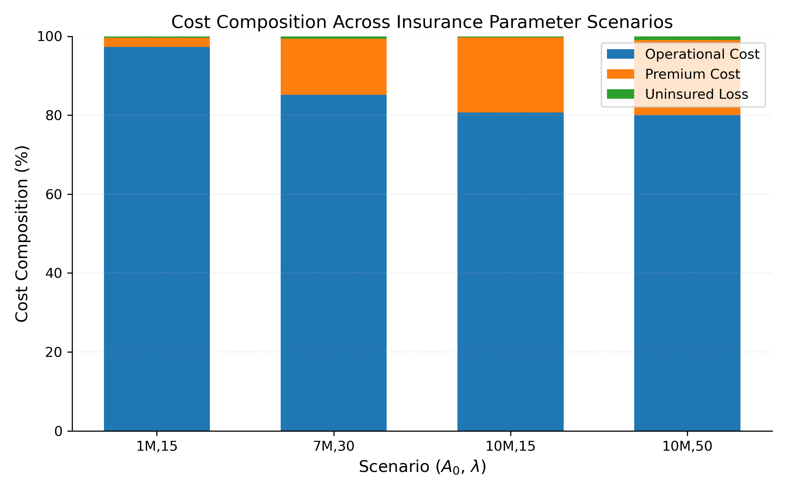

# Insurance-Integrated Hazardous Materials Transportation

Path-based mixed-integer optimization for allocating hazardous-material shipments under operational cost, population risk, corridor concentration, regional equity, and insurance-related financial exposure.

> **Release status:** private review version. The supplied thesis and implementation contain several material differences that should be resolved before this repository becomes public. See [Implementation audit](docs/implementation_audit.md).

This repository accompanies the master's thesis:

> Om Samel. *A Data-Driven Optimization Framework for Corridor Prioritization in Hazardous Materials Transportation: A Case Study of Erie County, NY.* University at Buffalo, 2026.

[Read the thesis](thesis/Om_Samel_MS_thesis.pdf)

## Research overview

The model assigns integer shipment flows from 40 Erie County facilities to 10 precomputed candidate paths per facility. It minimizes operational and insurance-related costs while controlling:

- system-wide population risk;
- corridor-level risk concentration;
- disparity in risk across six geographic regions; and
- excessive concentration of a facility's flow on one path.

The insurance terms represent the expected present value of future premium increases and the expected loss retained by the carrier after the deductible and liability limit.

## Results reported in the thesis

- 40 facilities, 400 facility-path alternatives, 8 tracked corridors, 6 regions, and 10 cost segments.
- Introducing insurance rerouted approximately 43-46% of shipment volume relative to the no-insurance baseline.
- Operational cost represented approximately 80-97% of the objective across the reported scenarios.
- The reported min-max choice was \(A(0)=7\) million and \(\lambda=50\), with 0.163% worst-case relative regret.

These numbers are transcribed from the thesis. The optimization experiments have not yet been rerun from a clean environment for this release.



## Repository structure

```text
.
├── data/                  Processed model inputs and saved sensitivity outputs
├── docs/                  Model, data, reproduction, and audit notes
├── figures/               Selected thesis figures
├── outputs/               Files generated when analysis scripts run
├── scripts/               Optimization and statistical-analysis scripts
├── tests/                 Solver-independent data-integrity checks
└── thesis/                Master's thesis PDF
```

## Quick start

Python 3.10 or newer is recommended.

```bash
git clone https://github.com/SamelOm/insurance-integrated-hazmat-transportation.git
cd insurance-integrated-hazmat-transportation

python3 -m venv .venv
source .venv/bin/activate
python -m pip install --upgrade pip
python -m pip install -r requirements.txt

python -m unittest discover -s tests -v
python scripts/solve_case_study.py
```

The optimization scripts require a working Gurobi license. Eligible university users can obtain a [free academic license](https://support.gurobi.com/hc/en-us/articles/360040541251-How-do-I-obtain-a-free-academic-license).

## Analysis scripts

| Script | Purpose |
| --- | --- |
| `solve_case_study.py` | Calibrate risk limits and solve the core Erie County model |
| `compare_accident_metrics.py` | Compare expected accidents and shipments per expected accident |
| `analyze_risk_tradeoffs.py` | Compare system and corridor risk behavior |
| `analyze_rerouting.py` | Measure rerouting relative to a no-insurance baseline |
| `analyze_cost_components.py` | Decompose operational, premium, and uninsured-loss costs |
| `run_factorial_analysis.py` | Run the blocked 3-by-3 factorial experiment and ANOVA |
| `analyze_new_paths.py` | Analyze newly activated paths across parameter settings |
| `run_minmax_regret.py` | Evaluate parameter choices across perturbed scenarios |

Generated tables and figures are written to `outputs/`.

## Data scope

The repository begins with processed facility-path inputs. It does not include the full raw GIS workflow, road network, Census geometry, or ArcGIS project used to construct candidate paths and exposure estimates. Accident probabilities are exogenous and severities are generated using a lognormal body with a Pareto tail.

See [Data dictionary](docs/data_dictionary.md) and [Reproducibility guide](docs/reproducibility.md).

## Citation and reuse

Citation metadata is provided in [`CITATION.cff`](CITATION.cff). No open-source license has been granted yet; the code and thesis remain all rights reserved until the author and advisor confirm an appropriate release license.

## Author

Om Samel  
Department of Industrial and Systems Engineering  
University at Buffalo
